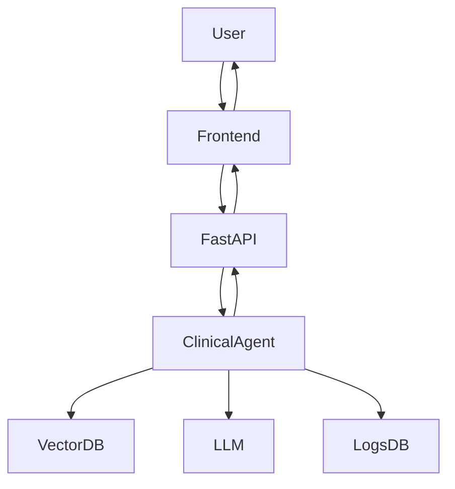

# System Architecture

## Overview
The Clinical Intelligence Agent is built using a Retrieval-Augmented Generation (RAG) architecture combined with rule-based insurance logic and human-in-the-loop (HITL) escalation.

The system consists of two main pipelines:
- Offline ingestion pipeline (document preparation)
- Online query pipeline (user interaction and response generation)

## High-Level Flow
1. User submits a question through the web interface
2. The backend processes the query and applies agent decision logic
3. Relevant guideline documents are retrieved from the vector database
4. The language model generates an answer based only on retrieved content
5. The interaction is logged in the database
6. If confidence is low, the query is escalated for human review

## Components

### 1. Document Ingestion Pipeline (Offline)
- PDF extraction from NICE guideline documents
- Text cleaning and normalization
- Token-aware chunking
- Embedding generation using a sentence embedding model
- Storage of embeddings in PostgreSQL with pgvector

This pipeline runs whenever new guideline documents are added.

### 2. Vector Database
- PostgreSQL with pgvector extension
- Stores text chunks and their embeddings
- Supports semantic similarity search for retrieval

### 3. Agent Logic Layer
The agent determines whether to:
- Answer directly
- Ask for clarification
- Escalate to human review

Decision is based on:
- Retrieval confidence
- Query completeness
- Safety constraints

### 4. Language Model
- Generates responses using retrieved guideline content
- Restricted to provided context
- Does not generate free-form medical advice

### 5. API Backend
- Built using FastAPI
- Handles user requests
- Manages retrieval and response generation
- Logs all interactions

### 6. Frontend Interface
- React-based web interface
- Allows users to submit questions
- Displays answers and system messages
- Admin-only view for logs and escalated queries

### 7. Logging and Audit Database
All interactions are stored, including:
- User question
- Retrieved documents
- Generated response
- Confidence score
- Escalation status
- Timestamp

This supports monitoring, auditing, and quality assurance.

## Data Update Process
When guideline documents are updated:
1. Old embeddings are removed
2. New documents are ingested
3. Vector index is rebuilt
4. System resumes service

## Design Considerations
- Grounded answers only (no hallucinated responses)
- Human review for low-confidence cases
- Full audit trail for compliance
- Modular design for scalability

## Future Improvements
- Add re-ranking for improved retrieval quality
- Support additional insurance plans
- Add automated evaluation metrics
- Improve multilingual support
